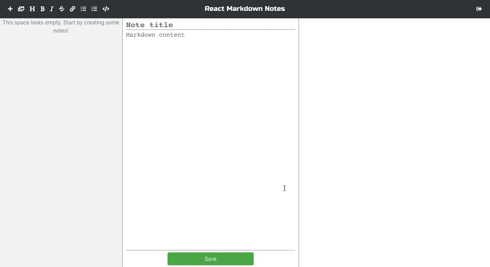

# Markdown Notes

React app that allows users to create, read, update and delete Markdown based notes. Also uses Redux, React Router and localStorage. Firebase is used for the backend.

<kbd>
  
</kbd>

Live version can be found [here](https://confident-blackwell-dc65d5.netlify.com/).